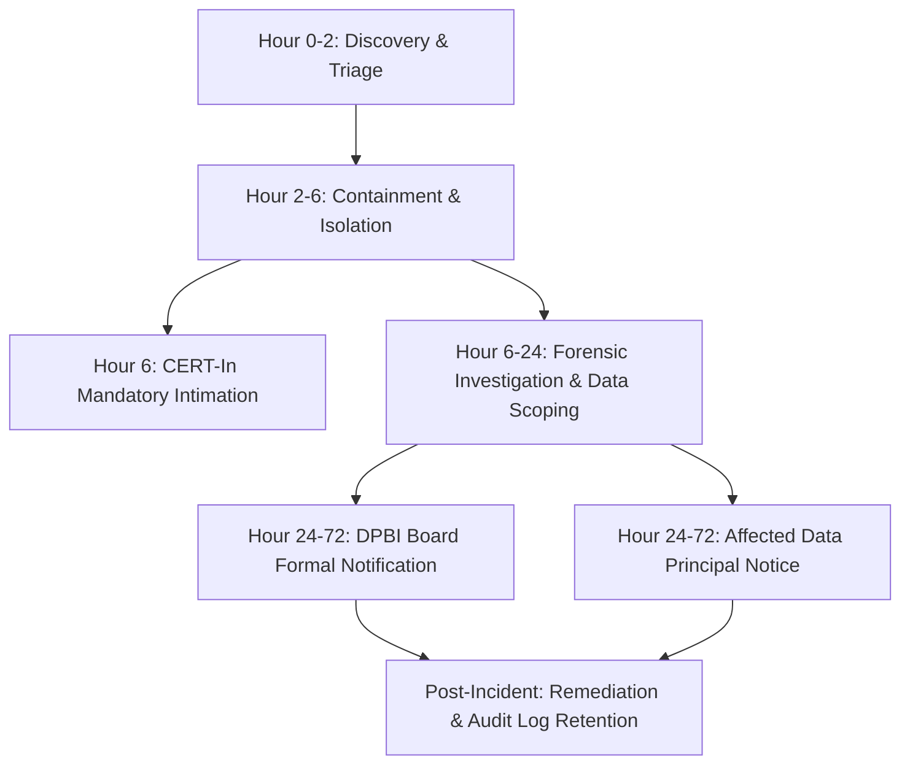

# VRPS Personal Data Breach & Incident Response Runbook
**Compliance Framework:** Digital Personal Data Protection (DPDP) Act 2023 (Section 8(6)), IT Act 2000, and CERT-In Cyber Security Directions 2022  
**Target Organization:** Vaddera Reservation Porata Samithi (VRPS)  
**Document Version:** 1.0 (August 2026)  
**Classification:** Internal Operational Security Protocol  

---

## 1. Objective and Statutory Scope

Under **Section 8(6) of the Digital Personal Data Protection Act, 2023**, in the event of a personal data breach, the Data Fiduciary is legally obligated to give the **Data Protection Board of India (DPBI)** and **each affected Data Principal** intimation of such breach in such form and manner as prescribed.

Additionally, under the **CERT-In Directions (April 2022)** under Section 70B of the IT Act, 2000, mandatory cybersecurity incidents must be reported to the Indian Computer Emergency Response Team (CERT-In) within **6 hours** of noticing.

---

## 2. Incident Classification & Severity Matrix

| Severity Level | Definition | Examples | Statutory SLA |
|---|---|---|---|
| **P1 - Critical Breach** | Unauthorized access, exfiltration, or loss of sensitive personal data affecting >100 users, or complete database exposure. | Appwrite DB breach, mass leakage of user addresses, phone numbers, HMAC signing key exposure. | **CERT-In:** ≤ 6 Hours<br>**DPBI Board:** ≤ 72 Hours<br>**Users:** Immediate / Concurrent |
| **P2 - High Severity** | Exposure of personal data affecting a targeted cohort (&lt;100 users) or partial leakage without payment exfiltration. | Single-user account compromise, unauthenticated verify endpoint scraping, unauthorized admin access. | **CERT-In:** ≤ 6 Hours<br>**DPBI Board:** ≤ 72 Hours<br>**Users:** ≤ 48 Hours |
| **P3 - Medium** | Localized vulnerability identified without evidence of active data exfiltration. | Misconfigured CORS header, missing rate limit on contact form, unverified token validation glitch. | Remediation ≤ 24 Hours<br>Internal audit log entry |
| **P4 - Low** | Minor security anomaly with zero personal data risk. | Scanned bot probes blocked by WAF, invalid signature attempts rejected. | Logged in weekly review |

---

## 3. Incident Response Lifecycle Checklist



### Phase 1: Discovery, Identification & Triage (Hours 0 – 2)
1. **Immediate Escalation:** Inform the Data Protection & Grievance Officer and Lead Developer immediately upon alarm/report.
2. **Preserve Forensic Evidence:**
   - Take snapshots of Appwrite server logs, Next.js application access logs, and Clerk audit logs.
   - Do NOT delete logs or wipe impacted databases prior to forensic imaging.
3. **Establish Incident Bridge:** Open an isolated, encrypted communications channel (Signal/secure email) for the Incident Management Team.

### Phase 2: Containment & Eradication (Hours 2 – 6)
1. **Rotate Vulnerable Credentials:**
   - Immediately rotate `APPWRITE_API_KEY`, `ID_CARD_JWT_SECRET`, and `RAZORPAY_KEY_SECRET`.
   - Invalidate active Clerk admin and user session tokens if token compromise is suspected.
2. **Network Isolation:** Block malicious IP subnets, isolate affected API microservices, or enable Cloudflare Under-Attack / strict WAF mode.
3. **Code Patching:** Deploy emergency hotfix to address root-cause vulnerability.

### Phase 3: Statutory Notifications (Hours 6 – 72)
1. **CERT-In Incident Report (≤ 6 Hours):** Submit incident report to `incident@cert-in.org.in` using standard CERT-In reporting format.
2. **DPBI Board Notification (≤ 72 Hours):** Transmit formal breach notice to the Data Protection Board of India using Template A below.
3. **Data Principal (User) Communication:** Deliver direct electronic notice (email / SMS) to all impacted users using Template B below.

### Phase 4: Remediation, Review & Retention (Day 4 – Day 30)
1. Complete Root Cause Analysis (RCA) and Corrective & Preventive Action (CAPA) report.
2. Archive all incident telemetry and communications for **8 years** under statutory audit retention requirements.

---

## 4. Template A: Data Protection Board of India (DPBI) Notice Template
*(Mandated under Section 8(6) of the DPDP Act 2023)*

```text
FORM OF INTIMATION OF PERSONAL DATA BREACH TO THE DATA PROTECTION BOARD OF INDIA
[Pursuant to Section 8(6) of the Digital Personal Data Protection Act, 2023]

To,
The Data Protection Board of India,
New Delhi, India.

Date of Intimation: [DD/MM/YYYY, HH:MM IST]
Notice Reference Number: VRPS-DPBI-BR-[YYYYMMDD]-[XXXX]

1. DATA FIDUCIARY DETAILS:
   a. Entity Name: Vaddera Reservation Porata Samithi (VRPS)
   b. Registration / Entity Type: Socio-Community Welfare Organization
   c. Address: VRPS Central Headquarters, India
   d. Designated Officer: Data Protection & Grievance Redressal Officer
   e. Contact Email: vaddera@gmail.com | Phone: +91 9876543210

2. DETAILS OF THE PERSONAL DATA BREACH:
   a. Date & Time of Occurrence: [DD/MM/YYYY, HH:MM IST]
   b. Date & Time of Discovery: [DD/MM/YYYY, HH:MM IST]
   c. Incident Type: [e.g. Unauthorized Access / Database Misconfiguration / Credential Leakage / Malware]
   d. Location / Component Affected: [e.g. Appwrite User Database / Verify Endpoint API / Storage Bucket]

3. SCOPE AND IMPACT OF THE BREACH:
   a. Estimated Number of Data Principals Affected: [Approximate Count, e.g., 250 members]
   b. Categories of Personal Data Compromised:
      [ ] Name, Mobile Number, Email Address
      [ ] Residential Location / Address (Village, Mandal, District, Pincode)
      [ ] Digital Membership ID Card Identifiers
      [ ] Transaction References & Donation Amounts
      [X] NOTE: No Plaintext Passwords, Credit Card Numbers, or CVVs were compromised.
   c. Assessed Risk / Potential Consequences to Data Principals:
      [e.g. Risk of targeted spam, phishing communication, or unauthorized identification]

4. CONTAINMENT AND MITIGATION MEASURES UNDERTAKEN:
   a. Containment Action: [e.g. Rotated API keys, revoked session tokens, patched API route at HH:MM IST]
   b. Technical Safeguards Implemented: [e.g. Enforced HMAC signature validation, added IP rate limiting, enabled Cloudflare WAF rules]
   c. Notifications to Affected Users: [e.g. Direct email notifications dispatched on DD/MM/YYYY to all affected members]
   d. Support Provided: [Dedicated helpdesk established at vaddera@gmail.com]

5. DESIGNATED CONTACT FOR REGULATORY INQUIRIES:
   Name: Administrative Nodal Officer
   Designation: Data Protection & Grievance Redressal Officer, VRPS
   Email: vaddera@gmail.com | Phone: +91 9876543210

Sign-off & Verification:
Authorized Signatory, VRPS
[Designation & Seal]
```

---

## 5. Template B: Notice to Affected Data Principals (Users)
*(Mandated under Section 8(6) of the DPDP Act 2023)*

**Subject:** Important Security Notice Regarding Your VRPS Account Information  
**Sent From:** `vaddera@gmail.com` (Official Data Protection Officer, VRPS)  

```text
Dear Member / Supporter of VRPS,

We are writing to inform you of a data security incident that may have involved some of your personal information, the immediate actions we have taken to protect you, and steps you can take.

1. WHAT HAPPENED:
On [Date, Time], our security monitoring team detected unauthorized access affecting [describe system component, e.g. our member verification service]. Our technical team contained the incident within [X] hours, closed the vulnerability, and rotated all security keys.

2. WHAT INFORMATION WAS INVOLVED:
According to our forensic review, the information accessed may have included:
• Your Full Name
• Registered Mobile Number and/or Email Address
• Regional Location Details (District / Mandal / State)
• Membership ID Number

IMPORTANT NOTE ON FINANCIAL DATA:
We do NOT store your credit card numbers, debit card numbers, UPI PINs, or net banking passwords. All payment transactions remain securely protected under Razorpay's PCI-DSS Level 1 compliant infrastructure and were NOT compromised.

3. WHAT WE HAVE DONE:
• Immediately isolated the affected systems and patched the security vulnerability.
• Rotated all backend access keys and strengthened server-side cryptographic signatures.
• Notified the Data Protection Board of India (DPBI) and CERT-In in compliance with the DPDP Act 2023.
• Implemented enhanced firewall filters and bot-protection rate limits across all platform endpoints.

4. WHAT YOU SHOULD DO:
While your account credentials remain secure via Clerk authentication, we recommend the following precautions:
• Be vigilant against unsolicited phone calls, SMS, or emails claiming to represent VRPS or requesting OTPs/passwords. VRPS will NEVER ask you for your passwords or bank PINs.
• Review your profile information at https://vaddera.org/profile to ensure your contact details remain accurate.
• If you notice any suspicious activity, report it immediately to our Grievance Officer.

5. FOR MORE INFORMATION & GRIEVANCE ASSISTANCE:
Your privacy and trust are of paramount importance to us. If you have questions or wish to exercise your data rights under the DPDP Act 2023, our Grievance Redressal Officer is available to assist you:

• Officer: Data Protection & Grievance Redressal Officer, VRPS
• Email: vaddera@gmail.com
• Helpline: +91 9876543210
• Data Rights Portal: https://vaddera.org/data-rights

Sincerely,
The Administrative & Data Protection Team
Vaddera Reservation Porata Samithi (VRPS)
```

---

## 6. Incident Telemetry & Post-Mortem Template

Every incident must generate a post-mortem document within **7 calendar days** stored securely in the compliance repository:

1. **Incident Timeline:** Millisecond-accurate timeline from initial exploitation to detection, containment, and recovery.
2. **Root Cause Analysis (5 Whys):** Deep-dive explanation of the vulnerability.
3. **Data Impact Radius:** Confirmed list of user IDs and data fields touched.
4. **Preventative Action Items (Jira/Linear backlog):** Assigned engineers with strict due dates.
5. **Regulatory Log Confirmation:** DPBI and CERT-In acknowledgment receipts appended.
